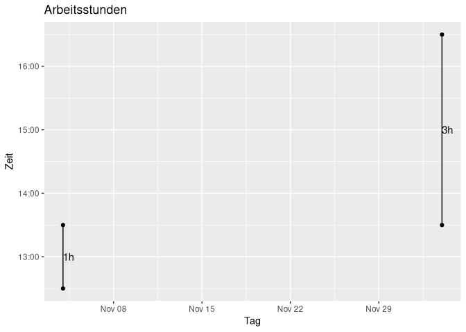

<!-- README.md is generated from README.Rmd. Please edit that file -->

# timesheet

<!-- badges: start -->
<!-- badges: end -->

The goal of timesheet is to make keeping track of working hours easier.

## Installation

You can install the development version of timesheet from
[GitHub](https://github.com/) with:

``` r
# install.packages("devtools")
devtools::install_github("max607/timesheet")
```

## Example

This is a basic example which shows you how to solve a common problem:

``` r
library(timesheet)

timesheet <- add_entry("2021-11-04 12:30:00", "2021-11-04 13:30:00", "Eating in office hours")
timesheet <- add_entry("2021-12-04 13:30:00", "2021-12-04 16:30:00", "Powernap", timesheet)
time_total(timesheet)
#> [1] "4h 0min"
time_month(timesheet, month = 11)
#> [1] "1h 0min"
time_month(timesheet, month = 12, work_left = TRUE, hours_per_month = 39)
#> [1] "36h 0min"
overview(timesheet)
```


